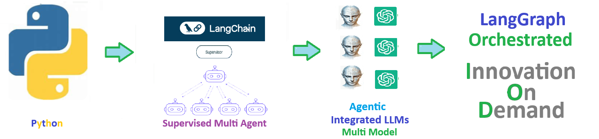

    
# Langgraph 

## Orchestrate Agentic AI with LangGraph and LangChain

    
## 🧠 LangGraph — A Framework to Jumpstart Your Agentic Projects

**LangGraph** and **LangChain** is a powerful, open source framework designed to accelerate the development of AI Agents  driven solutions. 

Balance agent control with agency 

Gain control with LangGraph to design agents that **reliably handle complex tasks**.

## 💡 The Purpose of Agentic Systems

LangGraph and **agentic systems** exist to **coordinate multi-step reasoning** and actions in a structured, state-aware way, allowing AI systems to make decisions, branch, retry, and use tools based on context rather than following a fixed pipeline. 

Their general purpose is to turn large language models from single-response generators into controlled, goal-driven systems that 
can plan, evaluate outcomes, recover from errors, and stop when conditions are met, making **complex workflows more reliable, interpretable, and safe.**

##  🩺 Example Population Health Workflow
#### 🩺 Major Sections of a Regional Epidemiology Report (Population Health)

1. **Background and Conditions of Interest** — Describe the diseases or health conditions being studied and their clinical and public-health relevance.  
2. **Population of Study** — Define the geographic region, inclusion/exclusion criteria, and characteristics of the population analyzed.  
3. **Incidence and Prevalence** — Quantify new cases (incidence) and total burden (prevalence) over defined time periods.  
4. **Temporal Observation Windows** — Specify the study timeframes, reporting periods, and any trend or seasonality analyses.  
5. **Demographic Stratification** — Break down outcomes by age groups, gender, race/ethnicity, and other key population attributes.  
6. **Geographic Distribution** — Analyze patterns by counties, ZIP codes, census tracts, or health-service regions.  
7. **Diagnosis and Coding Definitions** — Identify the major diagnosis groupings and coding systems used (e.g., ICD-10, SNOMED).  
8. **Treatment and Care Patterns** — Summarize common treatment protocols, interventions, utilization, and care pathways. (e.g., CPT ).  
9. **Comparisons to National and Global Benchmarks** — Compare regional findings to U.S. and global public-health reference data.  
10. **Summary and Conclusions** — Synthesize key findings, implications for population health, and actionable recommendations.

##  ⚒️ Steps to establish a LangGraph Agentic Workflow

1. **Define the goal 🥅** — Clearly state the single problem or capability the graph is meant to solve.
2. **Design the shared state** — Decide what information must persist and evolve across nodes.
3. **Identify the nodes** — Break the workflow into small, single-purpose steps.
4. **Implement node functions** — Write pure functions that take state in and return updated state.
5. **Determine conditional logic** — Identify where decisions, branching, or retries are required.
6. **Connect the edges** — Wire nodes together using static and conditional transitions.
7. **Set start 🚀  and end 🛑 points** — Explicitly define how the graph begins and terminates.
8. **Compile the graph** — Validate and lock the graph structure for execution.
9. **Test with simple inputs** — Run minimal cases to verify state transitions and routing.
10. **Add guardrails and logging** — Apply limits, error handling, and observability for safe execution.

# 🧩 LangGraph — A Framework to Jumpstart Your Agentic Projects

> Created by **ThriveAI  ...      Joe Eberle**  
> 🗓️ Started: April 18, 2025 
> 📫 Contact: [josepheberle@outlook.com](mailto:josepheberle@outlook.com)  
> 🔗 GitHub: [JoeEberle](https://github.com/JoeEberle/)

Welcome to the solution **Langgraph** 

Orchestrate Agentic AI with LangGraph and LangChain

 
## 🧠 LangGraph — A Framework to Jumpstart Your Agentic Projects

**LangGraph** and **LangChain** is a powerful, open source framework designed to accelerate the development of AI Agents  driven solutions. 

Balance agent control with agency 

Gain control with LangGraph to design agents that **reliably handle complex tasks**.

## 💡 The Purpose of Agentic Systems

LangGraph and **agentic systems** exist to **coordinate multi-step reasoning** and actions in a structured, state-aware way, allowing AI systems to make decisions, branch, retry, and use tools based on context rather than following a fixed pipeline. 

Their general purpose is to turn large language models from single-response generators into controlled, goal-driven systems that 
can plan, evaluate outcomes, recover from errors, and stop when conditions are met, making **complex workflows more reliable, interpretable, and safe.**

##  🩺 Example Population Health Workflow
#### 🩺 Major Sections of a Regional Epidemiology Report (Population Health)

1. **Background and Conditions of Interest** — Describe the diseases or health conditions being studied and their clinical and public-health relevance.  
2. **Population of Study** — Define the geographic region, inclusion/exclusion criteria, and characteristics of the population analyzed.  
3. **Incidence and Prevalence** — Quantify new cases (incidence) and total burden (prevalence) over defined time periods.  
4. **Temporal Observation Windows** — Specify the study timeframes, reporting periods, and any trend or seasonality analyses.  
5. **Demographic Stratification** — Break down outcomes by age groups, gender, race/ethnicity, and other key population attributes.  
6. **Geographic Distribution** — Analyze patterns by counties, ZIP codes, census tracts, or health-service regions.  
7. **Diagnosis and Coding Definitions** — Identify the major diagnosis groupings and coding systems used (e.g., ICD-10, SNOMED).  
8. **Treatment and Care Patterns** — Summarize common treatment protocols, interventions, utilization, and care pathways. (e.g., CPT ).  
9. **Comparisons to National and Global Benchmarks** — Compare regional findings to U.S. and global public-health reference data.  
10. **Summary and Conclusions** — Synthesize key findings, implications for population health, and actionable recommendations.

##  ⚒️ Steps to establish a LangGraph Agentic Workflow

1. **Define the goal 🥅** — Clearly state the single problem or capability the graph is meant to solve.
2. **Design the shared state** — Decide what information must persist and evolve across nodes.
3. **Identify the nodes** — Break the workflow into small, single-purpose steps.
4. **Implement node functions** — Write pure functions that take state in and return updated state.
5. **Determine conditional logic** — Identify where decisions, branching, or retries are required.
6. **Connect the edges** — Wire nodes together using static and conditional transitions.
7. **Set start 🚀  and end 🛑 points** — Explicitly define how the graph begins and terminates.
8. **Compile the graph** — Validate and lock the graph structure for execution.
9. **Test with simple inputs** — Run minimal cases to verify state transitions and routing.
10. **Add guardrails and logging** — Apply limits, error handling, and observability for safe execution.

# 🧩 LangGraph — A Framework to Jumpstart Your Agentic Projects

> Created by **ThriveAI  ...      Joe Eberle**  
> 🗓️ Started: April 18, 2025 
> 📫 Contact: [josepheberle@outlook.com](mailto:josepheberle@outlook.com)  
> 🔗 GitHub: [JoeEberle](https://github.com/JoeEberle/)

 

## Getting Started

The goal of this solution is to **Jump Start** your development and have you up and running in 30 minutes. 

To get started with the **Langgraph** solution repository, follow these steps:
1. Clone the repository to your local machine.
2. Install the required dependencies listed at the top of the notebook.
3. Explore the example code provided in the repository and experiment.
4. Run the notebook and make it your own - **EASY !**
    
## 🧠 Solution Features

- ✅ Easy to understand and use  
- ✅ Easily Configurable 
- ✅ Quickly start your project with pre-built templates
- ✅ Its Fast and Automated
- ✅ Saves You Time 

## ⚙️ Key Features

- ✅ **Self Documenting** Automatically identifies and annotates major steps in a notebook, making the codebase readable and well structured.
- ✅ **Self Testing** Includes built in **unit tests** for each function to validate logic and ensure code reliability.
- ✅ **Easily Configurable** Uses a simple **config.ini** file for centralized settings and easy customization through key value pairs.
- ✅ **Talking Code** explains itself through inline commentary, helping you understand both **what** it does and **why** it does it.
- ✅ **Self Logging** extends Python’s standard **logging** module for **step by step runtime insights**.
- ✅ **Self Debugging** Includes debugging hooks and detailed error tracing to simplify development and troubleshooting.
- ✅ **Low Code or  No Code** Designed to minimize complexity — most full solutions are under 50 lines of code.
- ✅ **Educational** Each template includes educational narrative and background context to support learning, teaching, and collaborative development.

    